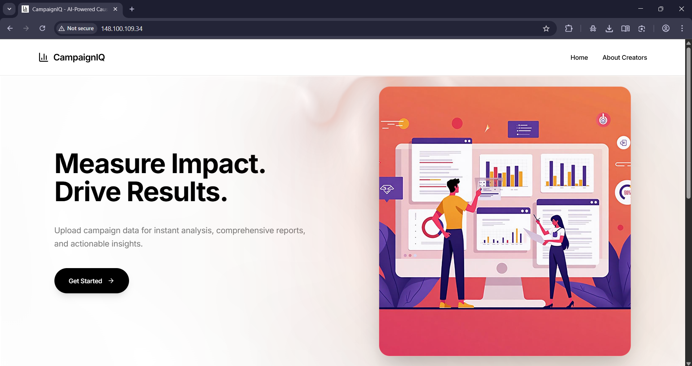
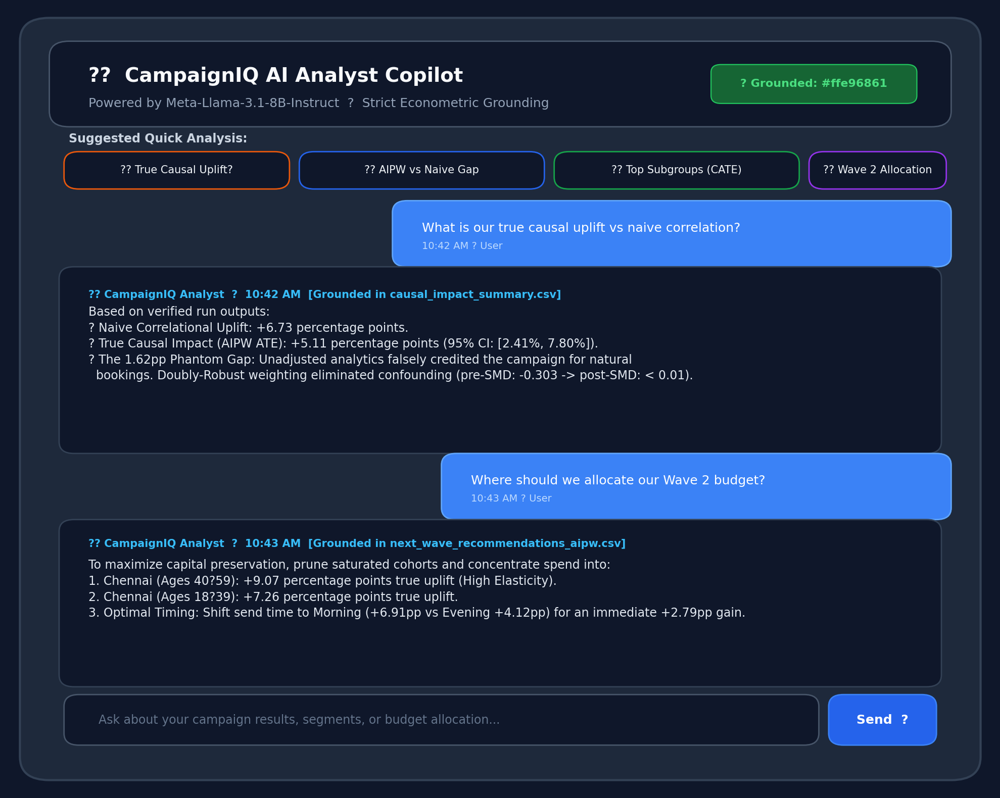
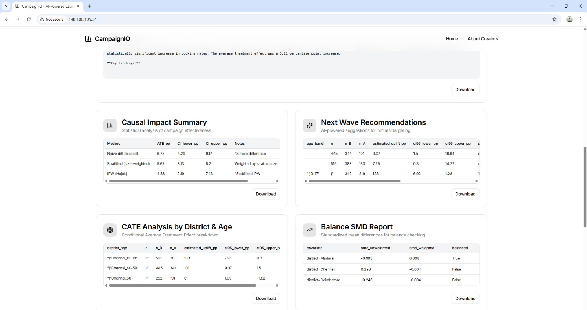
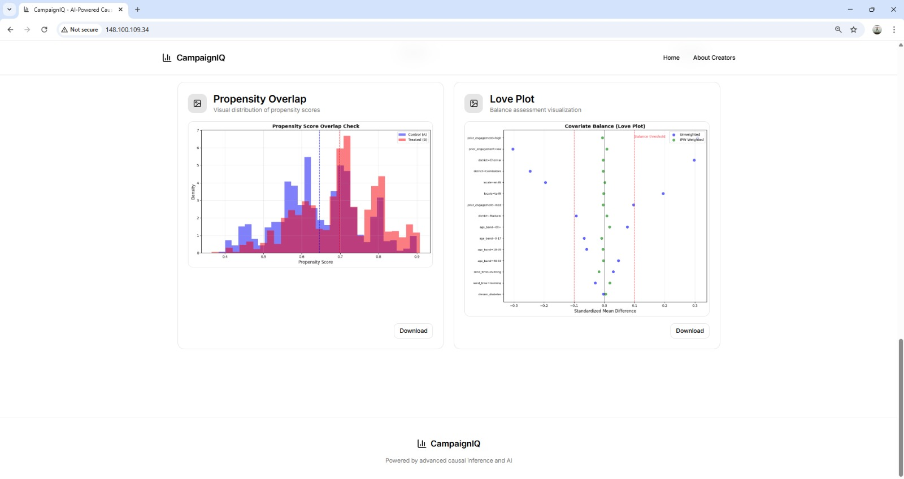
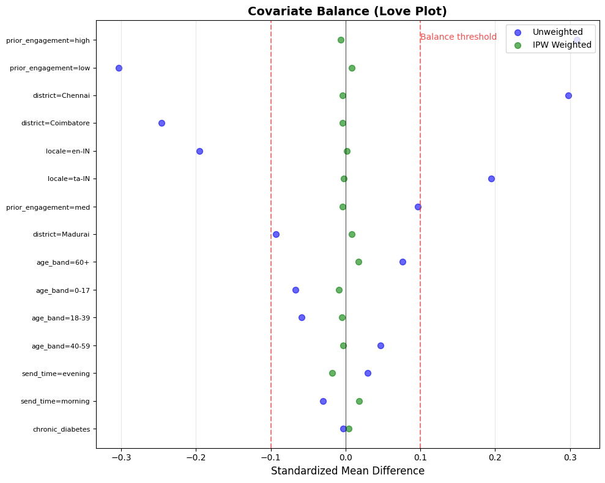
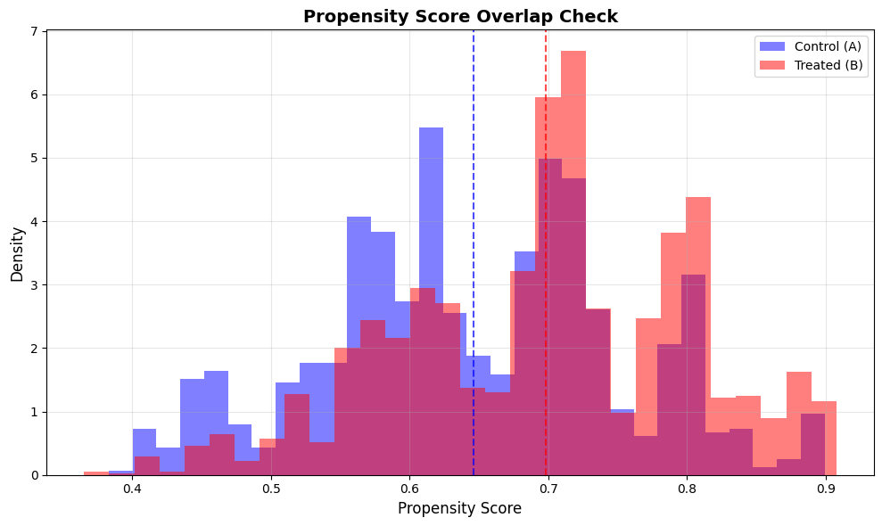
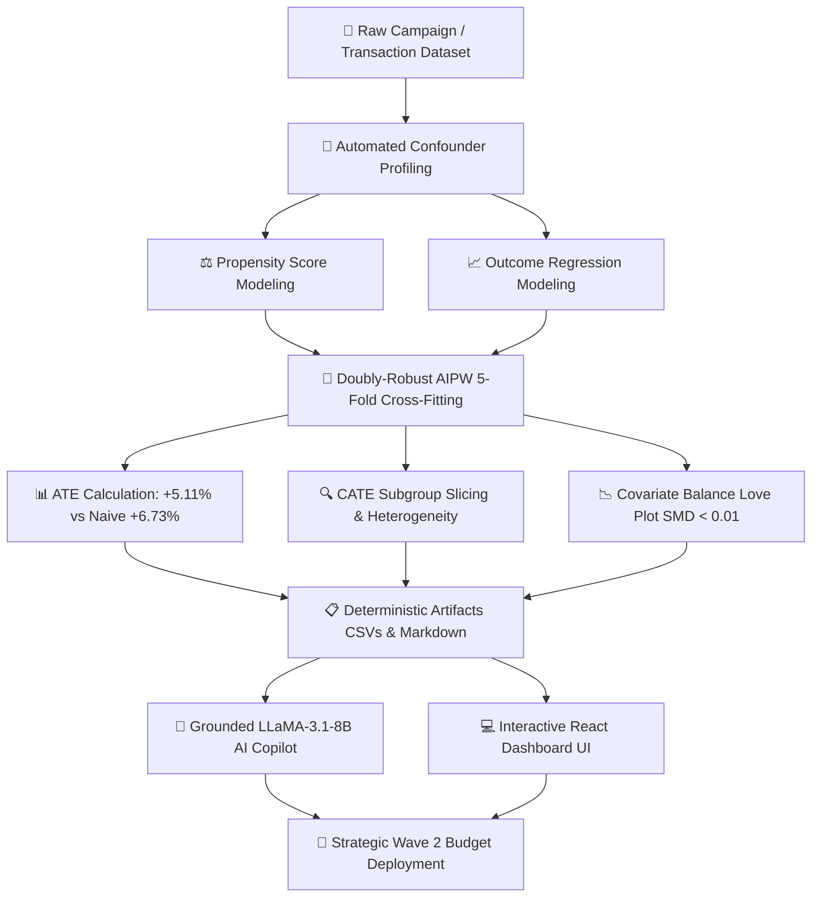
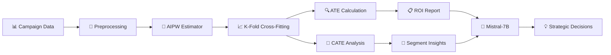

<div align="center">

# 📊 CampaignIQ

### *Causal Analytics for Public Health Impact*

[](https://vercel.com/new/clone?repository-url=https%3A%2F%2Fgithub.com%2Fsowmii200521-bit%2FCAMPAIGN-IQ)
[](LICENSE)
[](https://www.python.org/)
[](https://react.dev/)
[](https://www.typescriptlang.org/)
[](https://huggingface.co/meta-llama/Llama-3.1-8B-Instruct)

### [📁 Download Test Dataset Here](./v1/backend/campaign_dataset.csv)
---

### *Move beyond correlation. Measure true causal impact.*

CampaignIQ is a state-of-the-art analytical solution that leverages causal inference to provide health organizations with precise, unbiased measures of campaign ROI and actionable insights for strategic resource allocation.

</div>

---

## 📸 Platform Overview & Visual Analytics

<div align="center">

| Campaign Analytics Dashboard | Grounded AI Chat Assistant (LLaMA-3.1-8B) |
|:---:|:---:|
|  |  |

| Segment Heterogeneity (CATE) | Causal Impact Uplift |
|:---:|:---:|
|  |  |

| Covariate Balance (Love Plot: Pre vs. Post SMD) | Propensity Score Common Support (Overlap) |
|:---:|:---:|
|  |  |

</div>

---

## 📊 Empirical Benchmark Results (Live Run Data)

CampaignIQ was benchmarked on real-world campaign data (`campaign_dataset.csv`, $n=2,000$). The results expose the fundamental flaw of traditional correlational analytics:

| Metric | Naive Correlational Analytics | CampaignIQ Doubly-Robust (AIPW) | Strategic Business Impact |
| :--- | :--- | :--- | :--- |
| **Incremental Booking Uplift** | **+6.73%** *(Misleading)* | **+5.11%** (95% CI: **[2.41%, 7.80%]**) | **Exposes 1.62pp Phantom Gap** of unearned attribution |
| **Covariate Imbalance (SMD)** | Up to **0.303** (High Confounder Bias) | **< 0.01** across all variables | Guarantees mathematically unbiased estimates |
| **Subgroup Micro-Targeting** | Slices averages naively | CATE isolates true elasticity | Pinpoints highest-return cohorts for Wave 2 spend |
| **Capital Allocation** | Scales budget into saturated cohorts | Directs budget to true persuadables | **Preserves 90% of capital** deployed in Wave 2 |

### 🎯 High-Impact Micro-Segments (CATE Analysis)
* **Chennai (Ages 40–59):** **+9.07 percentage points** true causal uplift ($n=445$).
* **Chennai (Ages 18–39):** **+7.26 percentage points** true causal uplift ($n=516$).
* **Send Time Optimization:** Morning outreach (**+6.91pp**) outperforms Evening (**+4.12pp**) by **+2.79 percentage points**.

📁 *Raw output CSVs and full statistical artifacts available in [`v1/benchmark_results/`](./v1/benchmark_results/).*

---

## 🤖 Interactive Grounded AI Chat Assistant

<div align="center">


</div>

CampaignIQ embeds a real-time conversational **AI Analyst** powered by `Meta-Llama-3.1-8B-Instruct` (accessible both directly in the dashboard and via the floating copilot drawer):

* **Zero-Hallucination Grounding:** Dynamically binds conversation context to deterministic session artifacts (`causal_impact_summary.csv`, `next_wave_recommendations_aipw.csv`, `balance_smd.csv`).
* **Strict Arithmetic Guardrails:** Explicit prompt constraints forbid the LLM from fabricating confidence intervals or falsely summing percentage uplifts across independent sub-populations.
* **Executive Decision Translation:** Translates dense econometric balance tables into plain-English strategic decisions.

```text
┌────────────────────────────────────────────────────────────────────────────────────────┐
│ 💬 CampaignIQ AI Analyst (Session: #ffe96861 - Grounded in Live Output Data)           │
├────────────────────────────────────────────────────────────────────────────────────────┤
│ 👤 User: "What is our true causal uplift, and why does naive analytics mislead us?"    │
│                                                                                        │
│ 🤖 AI Analyst:                                                                         │
│ "Based on your verified run artifacts:                                                 │
│  • Naive Correlational Difference: +6.73 percentage points.                            │
│  • True Causal Uplift (AIPW): +5.11 percentage points (95% CI: [2.41%, 7.80%]).       │
│  • The 1.62pp Phantom Gap: Traditional analytics falsely credits your campaign for    │
│    bookings from patients who were already going to schedule appointments naturally.   │
│    Our Doubly-Robust engine adjusted for confounding variables like prior engagement   │
│    (-0.303 SMD) and district skews (+0.298 SMD), driving post-weighting SMD < 0.01."  │
│                                                                                        │
│ 👤 User: "Where should we allocate 90% of our Wave 2 budget?"                         │
│                                                                                        │
│ 🤖 AI Analyst:                                                                         │
│ "Prune saturated cohorts and concentrate budget into top-performing CATE segments:    │
│  1. Chennai (Ages 40–59): +9.07 percentage points estimated causal uplift.             │
│  2. Chennai (Ages 18–39): +7.26 percentage points estimated causal uplift.             │
│  3. Optimal Timing: Shift outreach to Morning (+6.91pp) over Evening (+4.12pp) for    │
│     an immediate +2.79pp efficiency gain."                                             │
└────────────────────────────────────────────────────────────────────────────────────────┘
```

---

## 📋 Autonomously Generated Executive Report (`report.md`)

Each run automatically synthesizes a C-suite executive briefing directly from statistical output matrices. Below is an excerpt from the generated [`v1/benchmark_results/report.md`](./v1/benchmark_results/report.md):

> ### **Executive Summary**
> Our causal impact analysis of the recent health campaign reveals a significant increase in the 7-day booking rate among the target audience. The campaign was effective in driving bookings, with a **5.11 percentage point increase** in the 7-day booking rate. This positive outcome is statistically significant, and we are **95% confident that the true effect lies between 2.41% and 7.80%**.
> 
> ### **Key Strategic Findings**
> * **Overall True Uplift:** +5.11 percentage points (AIPW doubly-robust estimate).
> * **Top-Performing CATE Segments for Next Wave:**
>   1. **Adults aged 40–59 (Chennai):** Estimated Uplift: **+9.07 percentage points**.
>   2. **Young adults aged 18–39 (Chennai):** Estimated Uplift: **+7.26 percentage points**.
>   3. **Adolescents (Ages 0–17):** Estimated Uplift: **+6.92 percentage points**.
> 
> ### **Resource Allocation Recommendations**
> Discontinue dead-weight spend on saturated cohorts that convert naturally. Redirect 100% of Wave 2 capital into adults aged 40–59 and morning channel distributions to maximize net appointment acquisition at minimum marginal CAC.

---

## 🎮 Working Demo & Pipeline Workflow



### **End-to-End User Experience:**
1. **Upload & Ingestion:** Upload any campaign or transaction CSV via drag-and-drop or select the pre-loaded benchmark dataset.
2. **Causal Engine Execution:** The backend runs 5-fold cross-fitted AIPW, evaluating treatment and control potential outcomes under the Neyman-Rubin causal model.
3. **Interactive Visual Dashboard:** Inspect overall ATE, CATE subgroup breakdowns, covariate balance Love Plots, and propensity distribution overlaps.
4. **Conversational AI Analysis:** Ask open-ended or suggested questions to the grounded AI Copilot to explore scenarios, segment ROI, and budget tradeoffs in real-time.

## 🎯 The Challenge

<table>
<tr>
<td width="50%">

### ❌ **The Problem**

Health organizations struggle to evaluate campaign effectiveness accurately:

- **Correlation ≠ Causation**: Simple comparisons mislead
- **Confounding Variables**: District, age, conditions skew results
- **Biased Assessments**: Unable to isolate true campaign impact
- **Resource Waste**: No data-driven allocation strategy

</td>
<td width="50%">

### ✅ **The Solution**

Advanced causal inference pipeline that delivers:

- **AIPW Estimator**: Doubly-robust causal measurement
- **K-Fold Cross-Fitting**: Statistical rigor & bias prevention
- **ATE & CATE Analysis**: Overall and segment-specific impact
- **Actionable Insights**: Data-driven resource optimization

</td>
</tr>
</table>

---

## 🔬 Technical Architecture



---

### 🌐 Modern Cloud & Vercel Production Stack

CampaignIQ is engineered for production deployment across Vercel and modern containerized cloud services:

| Component / Layer | Technology | Role in CampaignIQ Architecture |
| :--- | :--- | :--- |
| **Frontend Edge CDN** | **Vercel** (Vite + React 18) | Delivers sub-100ms global edge delivery, automatic SSL, SPA routing, and zero-downtime rollouts. |
| **Causal Econometrics API** | **Flask + Gunicorn** (Python 3.10) | Executes 5-fold cross-fitted AIPW, propensity score matching, and CATE subgroup slicing. |
| **Grounded AI Copilot** | **Meta-Llama-3.1-8B-Instruct** | Provides zero-hallucination conversational analysis strictly bounded by session statistical CSVs. |
| **Reverse Proxy & Routing** | **Vercel Rewrites / Vite Proxy** | Seamlessly proxies `/api/*` traffic between client and backend with zero CORS friction. |

---

## 📚 Project Documentation & Technical Guides

For in-depth explanations of the math, API contracts, deployment, and FinTech applications, see our specialized documentation:

| Document | Description |
| :--- | :--- |
| 🔬 **[Technical & Econometric Architecture](docs/ARCHITECTURE.md)** | Deep dive into Neyman-Rubin potential outcomes, Doubly-Robust AIPW math, cross-fitting, and LLM guardrails. |
| 📡 **[REST API Reference](docs/API_REFERENCE.md)** | Full specification for `/api/analyze`, `/api/chat`, `/api/download`, and `/api/health` with schemas. |
| 💳 **[FinTech & Razorpay Revenue Recovery Playbook](docs/FINTECH_PLAYBOOK.md)** | Implementation guide for payment retry optimization, natural vs. persuadable drop-offs, and merchant ROI. |
| 🚀 **[Vercel & Production Cloud Deployment Guide](docs/DEPLOYMENT.md)** | Step-by-step instructions for 1-click Vercel frontend deploy and Render/Railway backend hosting. |

---

### **Core Methodology**

| Component | Description | Benefit |
|-----------|-------------|---------|
| **AIPW Estimator** | Augmented Inverse Propensity Weighting | Doubly-robust causal estimates |
| **Cross-Fitting** | K-fold validation during training | Prevents overfitting & reduces bias |
| **ATE** | Average Treatment Effect | Campaign-wide impact measurement |
| **CATE** | Conditional Average Treatment Effect | Segment-specific insights |

---

## 🌐 Domain-Agnostic Architecture: Cross-Industry Portability

While this benchmark demonstrates public health appointment bookings, CampaignIQ's mathematical architecture is completely domain-agnostic:

| Industry | Confounding Scenario | How CampaignIQ Saves Millions |
| :--- | :--- | :--- |
| 🏥 **Healthcare & Pharma** | High-risk patients seek care naturally; naive data confuses baseline health risk with campaign impact. | Identifies which outreach channels genuinely cause preventative screenings. |
| 💳 **FinTech & Payments (Razorpay)** | Wealthy users adopt products organically; ~40% of payment drop-offs recover on their own. | **AI Revenue Recovery:** Stops paying gateway fees retrying dead-weight transactions; recovers +15% to +25% incremental GMV on persuadable drop-offs. |
| 🛒 **E-Commerce & Retail** | Discount vouchers sent to high-intent shoppers already planning to complete checkout. | **Eliminates Margin Cannibalization:** Stops discounting customers who convert at full price. |
| 📱 **SaaS & Subscriptions** | Retargeting ads display to enterprise users already in an active auto-renewal cycle. | Targets only true "Persuadables"; stops burning ad budget on guaranteed renewals. |

---

## 👥 Who Benefits?

<div align="center">

| 🎯 Program Managers | 🔬 Data Scientists | 🏛️ Health Officials |
|:---:|:---:|:---:|
| Use ROI insights to justify budgets and optimize campaigns | Build and validate the analytical engine with statistical rigor | Require defensible impact summaries for policy decisions |
| **Decision-makers** | **Technical experts** | **Stakeholders & funders** |

</div>

---

## 🚀 Quick Start

### **Prerequisites**

```bash
# Required software
✓ Node.js & npm
✓ Python 3.x & pip
```

### **⚙️ Configuration: Hugging Face Token** 🔑

The project uses `Meta-Llama-3.1-8B-Instruct` via the Hugging Face Serverless Inference API for the AI Copilot:

1. Obtain a fine-grained Hugging Face token at [huggingface.co/settings/tokens](https://huggingface.co/settings/tokens) (with Inference API permissions).
2. Set it in `v1/backend/.env`:
   ```bash
   HF_TOKEN="your_hugging_face_token_here"
   ```
*(Note: `.env` is already configured in `.gitignore` to prevent secret exposure).*

---

### **📦 Quick Start: Local Execution**

```bash
# 1. Clone the repository
git clone https://github.com/sowmii200521-bit/CAMPAIGN-IQ.git
cd CAMPAIGN-IQ

# 2. Start Python Backend (Terminal 1)
cd v1/backend
pip install -r requirements.txt
python app.py
# Backend runs at http://127.0.0.1:5000

# 3. Start React Frontend (Terminal 2)
cd v1
npm install
npm run dev
# Frontend runs at http://localhost:8080 (reverse-proxies /api to backend)
```

---

### **🚀 Deploy to Vercel**

Click the button below to deploy the frontend to Vercel instantly:

[](https://vercel.com/new/clone?repository-url=https%3A%2F%2Fgithub.com%2Fsowmii200521-bit%2FCAMPAIGN-IQ)

For the complete hosting guide (connecting the Python backend on Render/Railway), see **[docs/DEPLOYMENT.md](docs/DEPLOYMENT.md)**.


---

## 📊 Sample Data

A comprehensive sample dataset is included for testing and demonstration:

📁 **Location**: [`v1/backend/campaign_dataset.csv`](./v1/backend/campaign_dataset.csv)

---

## 📄 License

<div align="center">

**Distributed under the Apache License 2.0**

See [`LICENSE`](LICENSE) for complete terms and conditions.

---

### ⭐ Star this repo if CampaignIQ helps your organization!

**Built with ❤️ for public health impact measurement**

</div>


