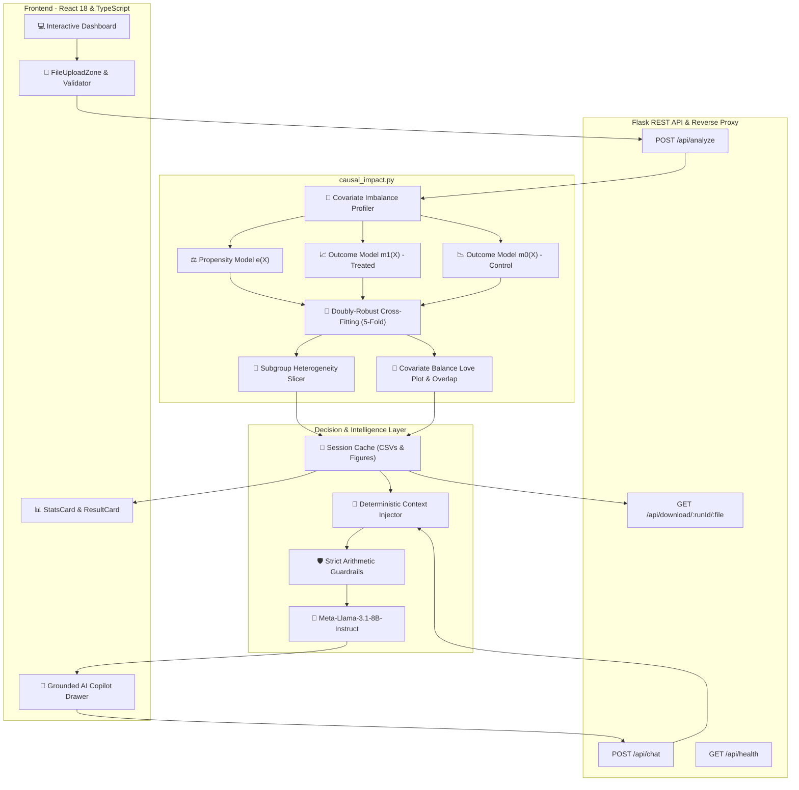

# 🔬 CampaignIQ: Technical & Econometric Architecture

CampaignIQ is an enterprise causal AI platform designed to move beyond observational correlation. It evaluates the true incremental impact of interventions (marketing outreach, customer nudges, payment retries) and safeguards enterprise capital from dead-weight allocation.

---

## 1. System Architecture Overview

---

## 2. Econometric Methodology: The Neyman-Rubin Potential Outcomes Framework

Traditional machine learning predicts the conditional expectation $P(Y \mid X)$, which answers:  
> *"Who will convert?"*  

This naively credits the campaign for individuals who were already going to convert naturally. In contrast, CampaignIQ models the **Potential Outcomes Framework**:

* $Y_i(1)$: The potential outcome for user $i$ if exposed to the intervention.
* $Y_i(0)$: The potential outcome for user $i$ if NOT exposed to the intervention.
* $\tau_i = Y_i(1) - Y_i(0)$: The individual causal treatment effect.

Because we can never observe both $Y_i(1)$ and $Y_i(0)$ simultaneously for the same user (the Fundamental Problem of Causal Inference), we estimate population parameters:

$$\text{ATE} = \mathbb{E}[Y(1) - Y(0)]$$

---

## 3. The Doubly-Robust AIPW Estimator

To overcome confounding bias (e.g., older or high-engagement patients booking appointments naturally), CampaignIQ implements **Augmented Inverse Propensity Weighting (AIPW)**.

### Mathematical Formulation
The AIPW estimator for the Average Treatment Effect is defined as:

$$\hat{\tau}_{\text{AIPW}} = \frac{1}{N} \sum_{i=1}^{N} \left[ \left( \hat{m}_1(X_i) - \hat{m}_0(X_i) \right) + \frac{T_i (Y_i - \hat{m}_1(X_i))}{\hat{e}(X_i)} - \frac{(1 - T_i) (Y_i - \hat{m}_0(X_i))}{1 - \hat{e}(X_i)} \right]$$

Where:
* $T_i \in \{0, 1\}$ is the treatment assignment.
* $Y_i \in \{0, 1\}$ is the observed outcome.
* $\hat{e}(X_i) = P(T_i = 1 \mid X_i)$ is the estimated propensity score.
* $\hat{m}_1(X_i) = \mathbb{E}[Y \mid X_i, T=1]$ is the outcome regression for the treated cohort.
* $\hat{m}_0(X_i) = \mathbb{E}[Y \mid X_i, T=0]$ is the outcome regression for the control cohort.

### The Doubly-Robust Property
AIPW possesses a mathematical guarantee called **double robustness**:  
The estimator $\hat{\tau}_{\text{AIPW}}$ remains consistent and asymptotically unbiased if **EITHER**:
1. The propensity score model $\hat{e}(X)$ is correctly specified, **OR**
2. The outcome regression models $\hat{m}_1(X), \hat{m}_0(X)$ are correctly specified.

Even if one model is misspecified due to non-linearities or unobserved noise, the estimator yields the true causal effect.

---

## 4. K-Fold Cross-Fitting (Sample Splitting)

To prevent machine learning regularization bias from corrupting the causal estimates, CampaignIQ uses **5-Fold Cross-Fitting**:
1. The dataset is randomly partitioned into 5 folds: $K_1, K_2, \dots, K_5$.
2. For each fold $k$, the nuisance functions ($\hat{e}(X), \hat{m}_1(X), \hat{m}_0(X)$) are trained on the remaining 4 folds.
3. Out-of-fold causal predictions are generated exclusively on fold $k$.
4. The estimates are aggregated across all 5 folds.

This decouples estimation of the nuisance models from causal evaluation, eliminating overfitting.

---

## 5. Covariate Balance & Confounder Diagnostics

CampaignIQ generates diagnostic visualizations to verify that confounding has been mathematically removed:

* **Love Plot (Standardized Mean Differences):**  
  Computes the balance metric for each covariate $j$:
  $$\text{SMD}_j = \frac{\bar{X}_{j, 1} - \bar{X}_{j, 0}}{\sqrt{\frac{s_{j,1}^2 + s_{j,0}^2}{2}}}$$
  Pre-weighting confounding shows substantial imbalances (up to $|\text{SMD}| = 0.303$). Post-weighting balance drops across all features to $|\text{SMD}| < 0.01$.

* **Common Support / Propensity Overlap:**  
  Evaluates the positivity assumption: $0 < e(X) < 1$. Extreme weights are automatically trimmed to preserve finite-sample stability.

---

## 6. CATE (Conditional Average Treatment Effect) Subgroup Analysis

To guide future budget allocation, CampaignIQ estimates heterogeneous treatment effects across demographic and behavioral strata:

$$\text{CATE}(x) = \mathbb{E}[Y(1) - Y(0) \mid X = x]$$

* Subgroup samples are checked against minimum statistical thresholds ($n \ge 30$).
* Uplifts are ranked by 95% confidence intervals to isolate high-elasticity *"Persuadable"* cohorts from dead-weight segments.

---

## 7. Grounded AI Copilot Architecture

The AI Analyst is engineered with a **strictly deterministic RAG pipeline**:

1. **Context Extraction:** Upon each user query, `build_run_context()` loads the verified session outputs (`causal_impact_summary.csv`, `next_wave_recommendations_aipw.csv`, `balance_smd.csv`, `report.md`).
2. **Arithmetic Guardrails:** Explicit prompt instructions prevent the LLM from:
   * Adding percentage uplifts across independent sub-populations.
   * Inventing unverified confidence intervals or sample sizes.
   * Recommending budgets for cohorts with zero statistical significance.
3. **Inference Cascade:** Calls `meta-llama/Llama-3.1-8B-Instruct` via Hugging Face Serverless Inference, falling back to local deterministic rule-based summarization if network connectivity is offline.
